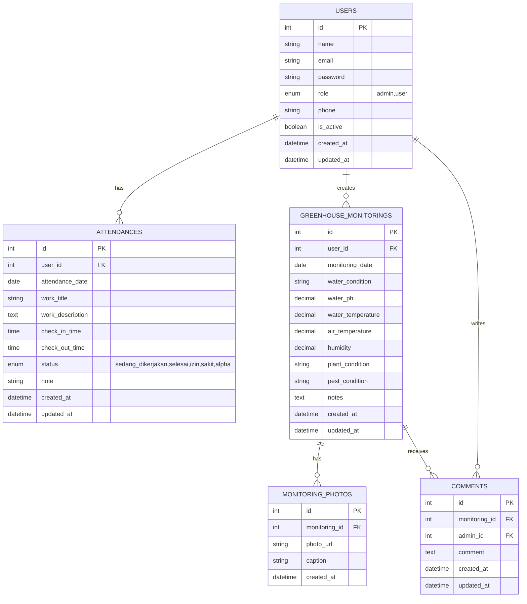

# ERD Sistem Dashboard Management Green House

## 1. Deskripsi

ERD ini digunakan untuk sistem Dashboard Management Green House dengan dua role pengguna, yaitu admin dan user.

Sistem mencakup data:

- Pengguna atau anggota
- Absensi
- Monitoring greenhouse
- Foto dokumentasi monitoring
- Komentar admin

## 2. Diagram ERD



## 3. Tabel Users

Tabel `users` menyimpan data admin dan anggota.

| Field | Tipe Data | Keterangan |
|---|---|---|
| id | int | Primary key |
| name | string | Nama pengguna |
| email | string | Email pengguna |
| password | string | Password yang sudah di-hash |
| role | enum | Role pengguna: admin atau user |
| phone | string | Nomor telepon |
| is_active | boolean | Status aktif akun |
| created_at | datetime | Waktu data dibuat |
| updated_at | datetime | Waktu data diperbarui |

## 4. Tabel Attendances

Tabel `attendances` menyimpan data presensi anggota berdasarkan aktivitas atau pekerjaan.

Dalam satu hari, satu user dapat memiliki beberapa data presensi karena pekerjaan yang dilakukan bisa berbeda.

| Field | Tipe Data | Keterangan |
|---|---|---|
| id | int | Primary key |
| user_id | int | Foreign key ke users.id |
| attendance_date | date | Tanggal presensi |
| work_title | string | Nama pekerjaan, contoh: mengantar buah atau membersihkan greenhouse |
| work_description | text | Deskripsi pekerjaan |
| check_in_time | time | Jam masuk atau waktu mulai pekerjaan |
| check_out_time | time | Jam keluar atau waktu selesai pekerjaan |
| status | enum | Status presensi: sedang_dikerjakan, selesai, izin, sakit, alpha |
| note | string | Catatan presensi |
| created_at | datetime | Waktu data dibuat |
| updated_at | datetime | Waktu data diperbarui |

Catatan:

- Tidak perlu unique berdasarkan `user_id` dan `attendance_date` karena user boleh presensi beberapa kali dalam satu hari.
- `check_out_time` dapat kosong saat pekerjaan masih berlangsung.
- Jika `check_out_time` diisi, nilainya tidak boleh lebih awal dari `check_in_time`.
- Sistem dapat membatasi agar user hanya memiliki satu presensi berstatus `sedang_dikerjakan` pada waktu yang sama jika aturan operasional membutuhkan.

## 5. Tabel Greenhouse Monitorings

Tabel `greenhouse_monitorings` menyimpan data monitoring kondisi air dan tanaman.

| Field | Tipe Data | Keterangan |
|---|---|---|
| id | int | Primary key |
| user_id | int | Foreign key ke users.id |
| monitoring_date | date | Tanggal monitoring |
| water_condition | string | Kondisi air |
| water_ph | decimal | Nilai pH air |
| water_temperature | decimal | Suhu air |
| air_temperature | decimal | Suhu udara |
| humidity | decimal | Kelembaban |
| plant_condition | string | Kondisi tanaman |
| pest_condition | string | Kondisi hama atau penyakit |
| notes | text | Catatan tambahan |
| created_at | datetime | Waktu data dibuat |
| updated_at | datetime | Waktu data diperbarui |

## 6. Tabel Monitoring Photos

Tabel `monitoring_photos` menyimpan foto dokumentasi dari data monitoring greenhouse.

| Field | Tipe Data | Keterangan |
|---|---|---|
| id | int | Primary key |
| monitoring_id | int | Foreign key ke greenhouse_monitorings.id |
| photo_url | string | Lokasi file foto |
| caption | string | Keterangan foto |
| created_at | datetime | Waktu data dibuat |

Catatan:

- Satu data monitoring dapat memiliki satu atau lebih foto.

## 7. Tabel Comments

Tabel `comments` menyimpan komentar admin terhadap input monitoring greenhouse.

| Field | Tipe Data | Keterangan |
|---|---|---|
| id | int | Primary key |
| monitoring_id | int | Foreign key ke greenhouse_monitorings.id |
| admin_id | int | Foreign key ke users.id |
| comment | text | Isi komentar admin |
| created_at | datetime | Waktu data dibuat |
| updated_at | datetime | Waktu data diperbarui |

Catatan:

- `admin_id` mengarah ke `users.id` dengan role admin.

## 8. Relasi Antar Tabel

| Relasi | Jenis | Keterangan |
|---|---|---|
| users ke attendances | One to many | Satu user memiliki banyak data absensi |
| users ke greenhouse_monitorings | One to many | Satu user dapat membuat banyak data monitoring |
| greenhouse_monitorings ke monitoring_photos | One to many | Satu monitoring dapat memiliki banyak foto |
| greenhouse_monitorings ke comments | One to many | Satu monitoring dapat memiliki banyak komentar |
| users ke comments | One to many | Satu admin dapat membuat banyak komentar |

## 9. Constraint yang Disarankan

```sql
ALTER TABLE attendances
ADD CONSTRAINT check_attendance_time_order
CHECK (
    check_out_time IS NULL
    OR check_out_time >= check_in_time
);
```

## 10. Query Leaderboard Presensi

```sql
SELECT
    users.id,
    users.name,
    COUNT(attendances.id) AS total_presensi_selesai
FROM users
JOIN attendances ON attendances.user_id = users.id
WHERE attendances.status = 'selesai'
GROUP BY users.id, users.name
ORDER BY total_presensi_selesai DESC
LIMIT 5;
```
